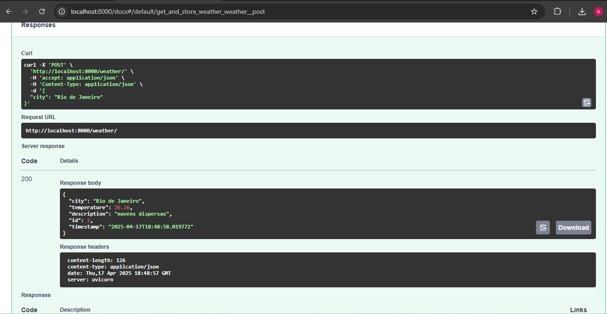
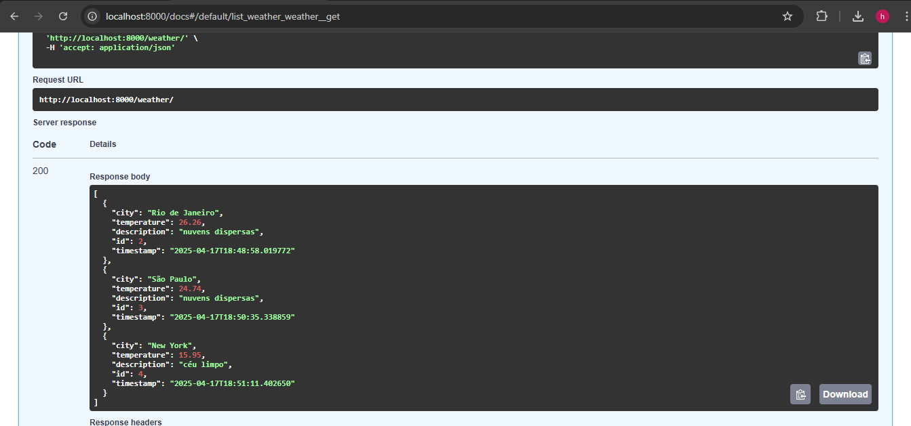

# 🌤️ Projeto de Consulta e Armazenamento de Dados Climáticos

Este projeto foi desenvolvido como parte de um teste técnico para uma vaga de Desenvolvedor Júnior. Ele consiste em uma aplicação baseada em **FastAPI** que realiza a **consulta de dados climáticos**, armazena esses dados em um banco de dados **PostgreSQL**, expõe endpoints RESTful e simula um **fluxo ETL com agendamento automático** e integração com um **WebHook** externo.

---

## 🚀 Tecnologias Utilizadas

- **[FastAPI](https://fastapi.tiangolo.com/)**: Framework web moderno e rápido para APIs com Python.
- **[PostgreSQL](https://www.postgresql.org/)**: Banco de dados relacional robusto e open-source.
- **[SQLAlchemy](https://www.sqlalchemy.org/)**: ORM para modelagem e persistência dos dados.
- **[APScheduler](https://apscheduler.readthedocs.io/)**: Agendador de tarefas para executar jobs de forma periódica.
- **[Docker](https://www.docker.com/)**: Containerização da aplicação para facilitar o setup e execução.
- **[Pydantic](https://pydantic-docs.helpmanual.io/)**: Validação de dados e definição de esquemas.

---

## 🧠 Funcionalidades

- 🔍 **Consulta de dados climáticos** de uma cidade usando uma API pública.
- 💾 **Armazenamento** dessas informações em um banco de dados PostgreSQL.
- 🧹 **Fluxo ETL simulado**, com transformação dos dados coletados.
- ⏱️ **Agendamento automático** para consulta de clima a cada 1 hora.
- 🌐 **WebHook simulando integração com sistemas externos**.
- 📦 **Containerização com Docker**, facilitando o deploy.

---

## 📂 Estrutura de Pastas

```
app/
├── __init__.py
├── database.py
├── models.py
├── schemas.py
├── weather.py
main.py
Dockerfile
docker-compose.yml
README.md
```

---

## 🔧 Como Executar o Projeto (com Docker)

1. **Clone o repositório:**

```bash
git clone https://github.com/seuusuario/nome-do-repositorio.git
cd nome-do-repositorio
```

2. **Configure o `.env` se necessário (opcional)**

3. **Suba os containers com Docker Compose:**

```bash
docker-compose up --build
```

4. Acesse a documentação automática da API (Swagger):

> http://localhost:8000/docs

---

## 🔁 Fluxo ETL

- O sistema coleta dados climáticos periodicamente (a cada 1 hora) com o agendador `APScheduler`.
- Os dados são transformados e preparados para consumo por outros sistemas.
- Um WebHook pode ser acionado automaticamente com os dados transformados para facilitar integrações com outras aplicações.

---

## 🔗 WebHook

- A aplicação pode enviar os dados de clima processados para um **endpoint externo**.
- O WebHook está configurado para simular a automação e integração com outros serviços.
- O envio é feito com `requests.post()` para uma URL configurada no código.

> **Nota:** O domínio `outrosistema.com` utilizado no exemplo é fictício e pode ser substituído por um real.

---

## 📦 Endpoints da API

### `GET /`
Verifica se a API está ativa.

### `POST /weather/`
Consulta a previsão do tempo para uma cidade e armazena no banco.

**Body Exemplo:**
```json
{
  "city": "São Paulo"
}
```


### `GET /weather/`
Lista todas as entradas salvas ou filtra por cidade.



**Exemplo:**
`/weather/?city=São Paulo`

### `DELETE /weather/{weather_id}`
Deleta um registro específico pelo ID.

---

## 👨‍💻 Considerações Finais

- O projeto foi desenvolvido com foco em **boas práticas**, **modularidade** e **legibilidade** do código.
- Está preparado para **crescimento**, podendo facilmente incorporar autenticação, cache, ou outras integrações futuras.

---

## 🤝 Autor

**Hélio Galdino**  
[LinkedIn](https://www.linkedin.com/in/helio-galdino-84412091/) • [GitHub](https://github.com/heliogald)
